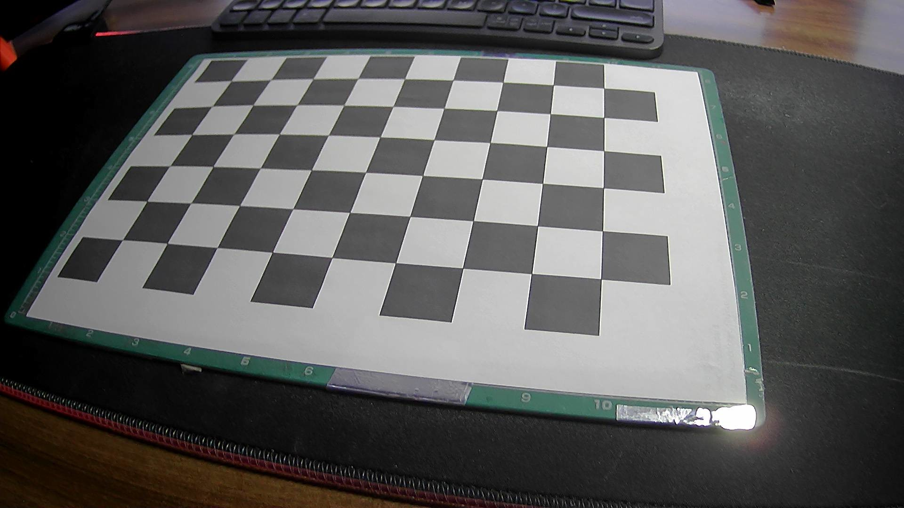
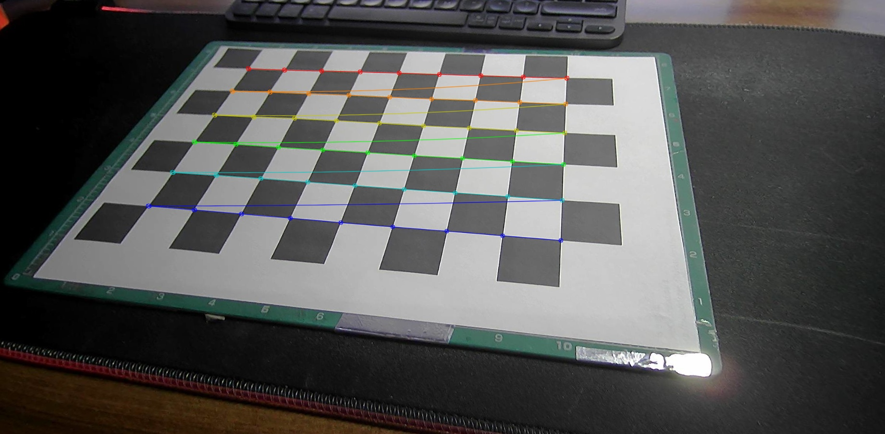

## Welcome to chessboard camera calibration project

This project provides users with ability to use chessboard camera calibration method, which correct lens distortions that occur in the mechanical and digital parts of camera.
Based on several shots of the chessboard, distortion-correcting parameters are calculated.

There are two ways of camera calibration
- Static Camera Calibration
- Live camera calibration

<h3 style="align-items: center; text-align: center;">Image example of fishEye distortion</h3>

  

    
    
<strong>Image before</strong>

  

  

    
    
<strong>Image after</strong>

  

## Static camera calibration  
As an input to camera calibration program you provide a photo or a series of photos which are distored. As an output program provides an undistorted photo and a text file with new calculated camera parameters.

## Live camera calibration
For this mode to run having working camera is required. Running the program provides you with GUI made with TKinter python library. 

Here will be o GUI photo

GUI consists of 4 panels. Original frame, frame with detected chessboard corners needed for camera calibration algorythm, output undistorted frame and control panel, that lets you add images based of which new camera parametres will be calculated, delete all of them  and button which calibrate camera based of caputred frames.  

## Used tools
- Python
- Various python Libraries (OpenCV,TKinter,Numpy)
- Chessboard camera calibration algorythm

Run main.py for live camera calibration.
Run static_images_calibration.py for basic, static camera calibration.
